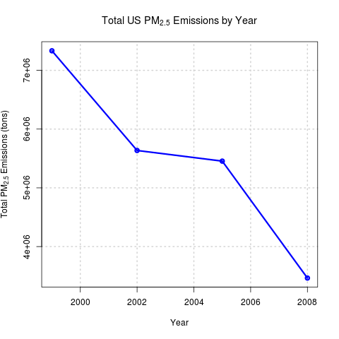
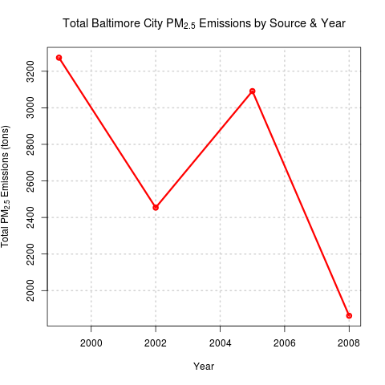
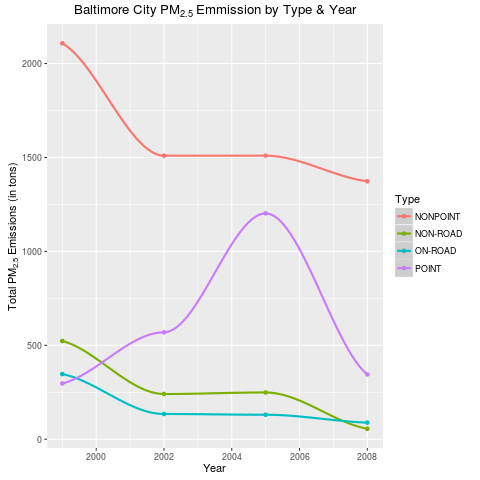
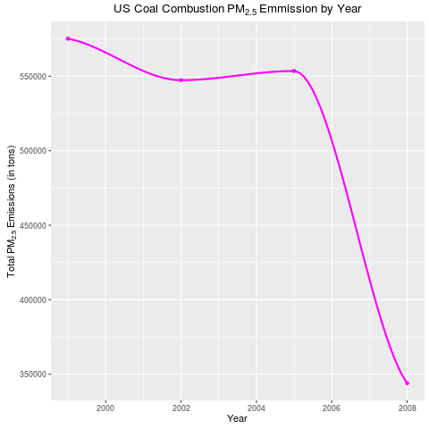
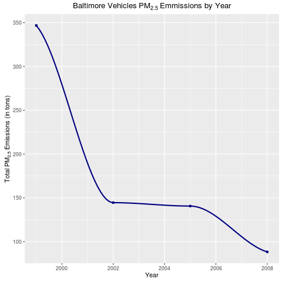
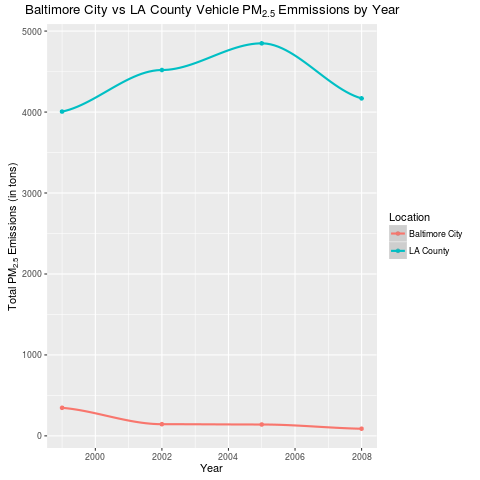

# Coursera - JH Exploratory Data Analysis
## Project 2 - Pollution Analyiss

Fine particulate matter ($PM_{2.5}$) is an ambient air pollutant for which there is strong evidence that it is harmful to human health. In the United States, the Environmental Protection Agency (EPA) is tasked with setting national ambient air quality standards for fine PM and for tracking the emissions of this pollutant into the atmosphere. Approximatly every 3 years, the EPA releases its database on emissions of PM2.5. This database is known as the National Emissions Inventory (NEI). You can read more information about the NEI at the [EPA National Emissions Inventory web site](http://www.epa.gov/ttn/chief/eiinformation.html).

For each year and for each type of PM source, the NEI records how many tons of $PM_{2.5}$ were emitted from that source over the course of the entire year. For this assignment we use data of the following years 1999, 2002, 2005, and 2008.

## Data


The data for this assignment are available from the course web site as a single zip file:

* [Data for Peer Assessment](https://d396qusza40orc.cloudfront.net/exdata%2Fdata%2FNEI_data.zip) [29Mb]

The zip file contains two files:

$PM_{2.5}$ Emissions Data (``summarySCC_PM25.rds``): This file contains a data frame with all of the PM2.5 emissions data for 1999, 2002, 2005, and 2008. For each year, the table contains number of **tons** of $PM_{2.5}$ emitted from a specific type of source for the entire year. Here are the first few rows.


```
##     fips      SCC Pollutant Emissions  type year
## 4  09001 10100401  PM25-PRI    15.714 POINT 1999
## 8  09001 10100404  PM25-PRI   234.178 POINT 1999
## 12 09001 10100501  PM25-PRI     0.128 POINT 1999
## 16 09001 10200401  PM25-PRI     2.036 POINT 1999
## 20 09001 10200504  PM25-PRI     0.388 POINT 1999
## 24 09001 10200602  PM25-PRI     1.490 POINT 1999
```


* ``fips``: A five-digit number (represented as a string) indicating the U.S. county
* ``SCC``: The name of the source as indicated by a digit string (see source code classification table)
* ``Pollutant``: A string indicating the pollutant
* ``Emissions``: Amount of PM2.5 emitted, in tons
* ``type``: The type of source (point, non-point, on-road, or non-road)
* ``year``: The year of emissions recorded

Source Classification Code Table (``Source_Classification_Code.rds``): This table provides a mapping from the SCC digit strings int he Emissions table to the actual name of the $PM_{2.5}$ source. The sources are categorized in a few different ways from more general to more specific and you may choose to explore whatever categories you think are most useful. For example, source "10100101" is known as "Ext Comb /Electric Gen /Anthracite Coal /Pulverized Coal".

You can read each of the two files using the ``readRDS()`` function in R. For example, reading in each file can be done with the following code:


```r
## This first line will likely take a few seconds. Be patient!
NEI <- readRDS("summarySCC_PM25.rds")
SCC <- readRDS("Source_Classification_Code.rds")
```

as long as each of those files is in your current working directory (check by calling ``dir()`` and see if those files are in the listing).

##Assignment

The overall goal of this assignment is to explore the National Emissions Inventory database and see what it says about fine particulate matter pollution in the United states over the 10-year period 1999–2008.

## Approach
This assignment requires programming R to download read the pollution data from two files, one of which is of 29MB in size.  Development is done in R studio in a Linux virtual machine with 3GB of allocated memory.  This means that processing data frames of approximately 30MB would pose no issue.  To improve performance dplyr library is used to process data.

## Questions and Answers

### Assignment Criteria

* Must address the following questions and tasks in exploratory analysis. For each question/task a single plot is made. Unless specified, any plotting system in R to make a plot can be used.
* For each plot, construct the plot and save it to a **PNG file**.
* Create a separate R code file (``plot1.R``, ``plot2.R``, etc.) that constructs the corresponding plot, i.e. code in plot1.R constructs the plot1.png plot. Code file should include code for reading the data so that the plot can be fully reproduced. Also include the code that creates the PNG file. Only include the code for a single plot (i.e. ``plot1.R`` should only include code for producing ``plot1.png``)
* Upload the PNG file on the Assignment submission page
* Copy and paste the R code from the corresponding R file into the text box at the appropriate point in the peer assessment.

---
Below are questions and answers, including plots, of this assignment

### Question 1
Have total emissions from $PM_{2.5}$ decreased in the United States from 1999-2008? Using the **base** plotting system, make a plot showing the total $PM_{2.5}$ emissions from all sources for each of the years 1999, 2002, 2005, and 2008.

### Answer 1
Plot 1 below shows that $PM_{2.5}$ decreased from 7.3 million to 3.4 million tons between 1999 and 2008. It is sharply reduced from 1999-2002 then reducing less slightly from 2002-2005.  It is sharply reduced again between 2005 and 2008



### Question 2
Have total emissions from $PM_{2.5}$ decreased in the **Baltimore City**, Maryland (``fips == "24510"``) from 1999-2008? Use the base plotting system to make a plot answering this question.

### Answer 2
Plot 2 shows that $PM_{2.5}$ decreased from about 3200 tons to 1800 tons between 1999 and 2008. It is sharply reduced from 1999-2002 then sharply increased from 2002-2005.  It then is sharply reduced between 2005 and 2008.



### Question 3
Of the four types of sources indicated by the ``type`` (point, nonpoint, onroad, nonroad) variable, which of these four sources have seen decreases in emissions from 1999-2008 for **Baltimore City**? Which have seen increases in emissions from 1999-2008? Use the **ggplot2** plotting system to make a plot answer this question.

### Answer 3
* Sources of type *__nonpoint__*, *__onroad__*, and *__nonroad__* decreased in $PM_{2.5}$ emmisions from 1999-2008.
* Sources of type *__point__* had an overall slight increase in $PM_{2.5}$ emissions from 297 tons in 2005 to 345 tons in 2008 even though emmissions did peak to 1200 tons in 2005.



### Question 4
Across the United States, how have emissions from coal combustion-related sources changed from 1999-2008?

### Answer 4
Total US $PM_{2.5}$ from coal combustion sources:

* Slightly reduced from 1999-2002.
* Ticked up a bit from 2002-2005.  
* Decreased sharply from 554 thousand tons in 2005 to 344 thousand tons in 2008.



### Question 5
How have emissions from motor vehicle sources changed from 1999-2008 in **Baltimore City**?

### Answer 5
$PM_{2.5}$ decreased from 347 tons in 1999 to 88 tons in 2008. The most significant decrease was between 1999 and 2002 when emmisions fell from 347 tons to 144 tons.



### Question 6
Compare emissions from motor vehicle sources in Baltimore City with emissions from motor vehicle sources in **Los Angeles County**, California (``fips == "06037"``). Which city has seen greater changes over time in motor vehicle emissions?

### Answer 6
To Baltimore City (red), LA County (blue) covers a much larger geographic area and a much larger volume of vehicles.  This means that $PM_{2.5}$ emmissons between these regions would be starkly different. In 2005, $PM_{2.5}$ emissions in Baltimore City was at **141 tons vs. 4800 tons** in LA county. The emmissions in LA County dwarfed that of Baltimore City.

$PM_{2.5}$ emissions levels in both Baltimore City and LA County did not change significantly from 1999-2008.

+ **Baltimore City** did experience a *proportionally* **significant decrease** (347 down to 88 tons) in $PM_{2.5}$ emissions during this period while

+ **LA County** experienced a *proportionally* **slight increase** (4005 to 4168 tons) in $PM_{2.5}$ emissions.




